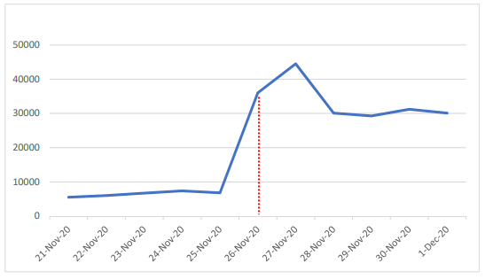

# An Estimation for Asymptomatic Covid-19 Cases of Turkey
### A multivariate polynomial regression model

### Acknowledgments

##### This project has 2 different datasets from 2 different sources. I have prepared one of them in another project which used data from "COVID-19 Data Repository by the Center for Systems Science and Engineering (CSSE) at Johns Hopkins University", link to their repo is https://github.com/CSSEGISandData/COVID-19.

##### The second dataset is processed with the data from the Ministry of Health in Turkey 

##### Several studies inspired me to create a new feature. These studies are;

Jombart T, van Zandvoort K, Russell TW et al. Inferring the number of COVID-19 cases from recently reported deaths [version 1; peer review: 2 approved]. Wellcome Open Res 2020, 5:78 (https://doi.org/10.12688/wellcomeopenres.15786.1)

Pueyo T. Coronavirus: Why You Must Act Now (https://tomaspueyo.medium.com/coronavirus-act-today-or-people-will-die-f4d3d9cd99ca)

Linton NM, Kobayashi T, Yang Y, Hayashi K et al. Incubation Period and Other Epidemiological Characteristics of 2019 Novel Coronavirus Infections with Right Truncation: A Statistical Analysis of Publicly Available Case Data. Journal of Clinical Medicine. 2020; 9(2):538. https://doi.org/10.3390/jcm9020538

### Problem

The Republic of Turkey was one of the countries which announce only symptomatic Covid-19 cases. Yet, this policy only took about 3 months.

The Ministry referred to these numbers as "patients" rather than "cases". They started to announce asymptomatic cases once again and revealed the total case numbers in the country. 

Secondary repositories kept these numbers as if they were case numbers and this caused significant changes in the recording standards for the country. Actual case numbers are now known but we still do not have the daily increases for this gap.

The graph above shows the leap on the day that the Ministry started to announce case numbers once again according to secondary repositories.

### The Goal of the Project

This project aims to estimate daily increases of case numbers for these days. There are several facts and data that make it possible to build a highly accurate machine learning model to solve this problem. 

These facts are:

    1. Total case numbers are known.
    
    2. This policy only took part of the total duration of the pandemic and it was in the middle. 
       We know the case numbers of the first months and the last months. 
       
### Timeline
###### On the 29th of July 2020, the phrase "Case" changed to "Patients" on the graphs that the Ministry of Health shares with the public
            Turkey started to announce only the symptomatic cases.
            Secondary repositories kept recording these numbers as cases.
            
###### On the 25th of November 2020, the Ministry started to announce the cases once again
            There were not any adjustments for the previous cases.
            
###### On the 10th of December 2020, the Ministry revealed missing previous cases cumulatively
            Secondary repositories kept this number as if the cases were discovered that day.
            
### Methodology

  Linear correlation, p-value, cross-validation and comparing with the cumulative cases for the gap are used to measure the accuracy of the model.

  Daily tests and recovered cases are used as features in the model.
  
  The most related feature was increases in deaths from 15 days later. This feature is created to acquire a stronger relation. It takes approximately 15 days to die from Covid-19 (Linton et al., 2020). Inspirations of this feature were mentioned in the acknowledgments section.
  
  Estimations are also used as coefficients to distribute cumulative cases that were announced on the 10th of December 2021 as an adjustment.
  
### Contents

This repository contains a jupyter notebook that shows all of the steps from scratch to an estimation and an adjustment.

You will also find a csv file that contains several covid-19 attributes and the estimations.
